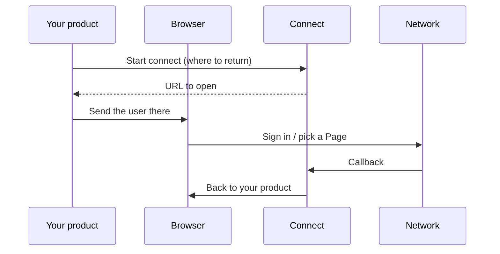

Connecting a network happens in the **browser**. You never send your API key to Facebook, LinkedIn, or X. Connect hosts OAuth, Page pickers, and the credential screens (Bluesky app password, Mastodon instance, Telegram `/connect` code).

There is **no MCP connect tool**. An agent publishes to accounts that are already connected.

For yourself, connect from [Accounts](https://connect.trypost.it/accounts) in the dashboard. For your users, start the same flow from your backend and send them to the URL Connect returns.

Paths and query params: [Connect social account](/api-reference/social-accounts/connect).

## What the user sees

| Network | What opens |
|---|---|
| X | X OAuth. Always billable. |
| TikTok | TikTok OAuth |
| YouTube | Google OAuth |
| Facebook | Facebook OAuth, then Connect's Page picker when the login has more than one Page |
| Instagram | Instagram Login (no Facebook Page) |
| Instagram via Facebook | Facebook OAuth, then Connect's Page picker for a Page-linked Instagram |
| LinkedIn | LinkedIn OAuth, then Connect's profile / Page picker |
| LinkedIn Page | LinkedIn OAuth scoped to Pages, then the same picker |
| Threads | Threads OAuth |
| Pinterest | Pinterest OAuth |
| Discord | Discord OAuth |
| Bluesky | Connect-hosted app-password form |
| Mastodon | Connect-hosted instance URL, then that instance's OAuth |
| Telegram | Connect-hosted `/connect <code>` screen |

You do not send people to the Connect dashboard to finish this.

## When they come back

On success, the browser lands on the return URL you passed in, with the network and the new social-account id. On failure, the same URL gets an `error` instead.

| `error` | Meaning |
|---|---|
| `access_denied` | The user (or the network) cancelled |
| `invalid_state` | The session is missing, expired (15 minutes), or for another network |
| `session_expired` | Connect no longer has this flow |
| `error_connecting` | The network or Connect failed while finishing |
| `payment_required` | X, or a third non-X account, without a subscription |
| `network_taken` | This Connect account already has that identity |
| `wrong_account` | Reconnect came back as a different person |
| `busy` | Another connect on this network is still finishing |
| `account_not_found` | The Connect account for this flow no longer exists |

Read identities by **id**, not by network name. The same network can appear more than once (two LinkedIns, three Instagrams). The same person cannot sit twice — reconnecting updates the existing row. Instagram Login and Instagram via Facebook are one identity, not two.

A connected account can later show as expired. Connect skips expired identities at publish time until the user reconnects.

## After they are connected

- Group them with [social sets](/guides/social-sets).
- Disconnect from the dashboard or the API.
- Pinterest needs a board and Discord needs a channel before you can publish — pick those when you compose the post.

Connecting X, or a third non-X identity, without a card is refused.
