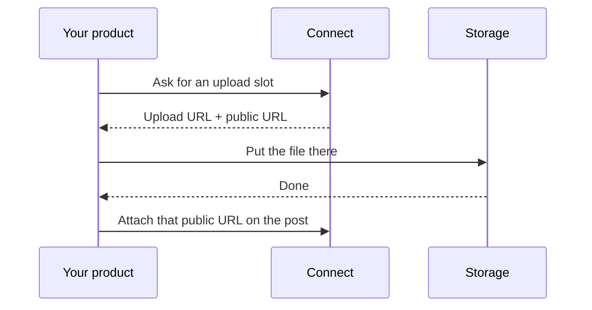

Connect does not download files from a public URL. There is no asset library and no “attach this image from the web.”

You ask Connect for an upload slot, put the bytes there, and pass the **public URL it gave you** when you create or update the post.

The upload URL is signed. Do not send your API key to storage. It expires in **one hour**. An unused file is deleted after **7 days**; attaching it to a post keeps it.

Request shapes: [Presign](/api-reference/media/presign) and [Upload](/api-reference/media/upload). Agents use `request-media-upload-tool`, then the same public URL on create or update.

## What you can send

| Kind | Formats | Cap |
|---|---|---|
| Image | JPEG, PNG, GIF, WebP | 10 MB |
| Video | MP4, MOV | 1 GB |
| Document | PDF | 100 MB |

No standalone audio. No WebM. Networks often impose a tighter cap when you **schedule or publish** — drafts are not blocked. See the [platform pages](/platforms/linkedin).

Optional alt text (up to 2 000 characters). Each network may truncate it further.

## Per-network media

A post has shared media. One network can override that with its own files, inherit the shared set, or publish with **no** media.

Limits (count, GIF vs still, duration) run against whatever that network will actually send.

## What does not work

- Pasting `https://example.com/photo.jpg` (or any CDN you host)
- Browsing a library of past uploads
- Attaching a file after the post exists as a separate “media” step — it goes on the post itself
