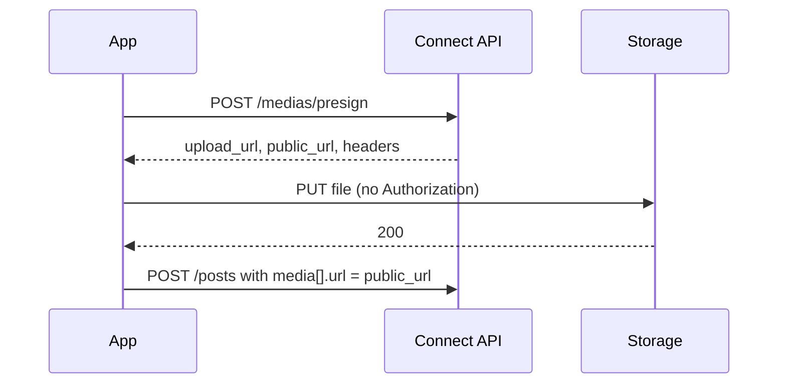

Connect does not download files from the public internet. A media item on a post must be a `public_url` issued by [`POST /medias/presign`](/api-reference/media/presign) (or an item Connect already hosted, with `path` set).

There is no asset library and no `POST /posts/{id}/media`.



## 1. Presign

```bash
curl -X POST https://connect.trypost.it/api/medias/presign \
  -H "Authorization: Bearer YOUR_API_KEY" \
  -H "Content-Type: application/json" \
  -d '{
    "filename": "clip.mp4",
    "content_type": "video/mp4",
    "size": 10485760
  }'
```

```json
{
  "upload_url": "https://…",
  "public_url": "https://…/temp/{account_id}/{ulid}_clip.mp4",
  "key": "temp/{account_id}/{ulid}_clip.mp4",
  "expires_in": 3600,
  "headers": { "Content-Type": "video/mp4" }
}
```

Allowed `content_type` values: `image/jpeg`, `image/jpg`, `image/png`, `image/gif`, `image/webp`, `video/mp4`, `video/quicktime`, `application/pdf`.

Upload caps (rejected at presign when `size` is sent): **10 MB** image, **1 GB** video, **100 MB** PDF. Networks may impose tighter limits at schedule or publish time.

`upload_url` expires in `expires_in` seconds (1 hour). An unused temp object is deleted after **7 days**. Attaching it to a post moves it out of `temp/`.

The signed PUT is rate-limited: **60 / minute per account**, **1200 / minute per IP**.

## 2. PUT the file

Send the bytes to `upload_url` with the returned `headers`. **Do not** send `Authorization`.

On Cloud this is an object-storage signed URL. Locally it is a signed [`PUT /medias/{token}`](/api-reference/media/upload). You never call that path with a Bearer token.

```bash
curl -X PUT "$UPLOAD_URL" \
  -H "Content-Type: video/mp4" \
  --data-binary @clip.mp4
```

Success is `200` with an empty body.

## 3. Attach on the post

```json
{
  "media": [
    {
      "url": "https://…/temp/…/clip.mp4",
      "meta": { "alt_text": "Product shot" }
    }
  ]
}
```

`url` must be that `public_url`. A random CDN or `https://example.com/photo.jpg` returns **422**.

`meta.alt_text` is optional (max **2000**). Publishers truncate further to each network's own cap.

The same shape is valid on `platforms[].custom_media` for a per-network override. `null` (or omitting the key) inherits the shared `media`. `[]` is an explicit no-media publish for that network.

MCP: `request-media-upload-tool` issues the same presign. Then pass `public_url` to `create-post-tool` / `update-post-tool` as `media[].url`. There is no attach-from-URL tool.

## Types

A media item is one of **image**, **video**, or **document** (PDF). There is no standalone audio type. WebM is not accepted.

Per-network counts, GIF/MOV rules, and byte/duration caps are enforced when you **schedule or publish**, against each platform's **effective** media (`custom_media` when set, otherwise root `media`). Drafts are not blocked. Ask MCP `list-content-types-tool` or see the [platform pages](/platforms/linkedin).
