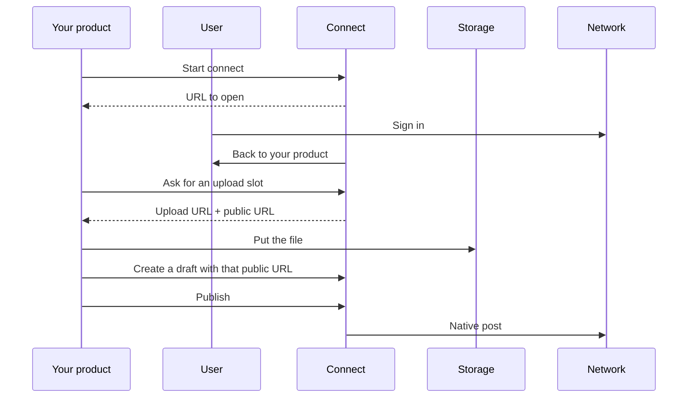

TryPost Connect is the layer you call to connect social accounts, upload media, and publish natively. You keep the editor and the queue. We run OAuth, tokens, storage, and the networks.

It is not a calendar and not an agency suite. There is no asset library.

<CardGroup cols={3}>
  <Card title="Get started" icon="rocket" href="/getting-started/quickstart">
    Account, connect a network, create a token.
  </Card>
  <Card title="API reference" icon="code" href="/api-reference/introduction">
    Every REST endpoint.
  </Card>
  <Card title="MCP" icon="microchip" href="/guides/mcp">
    The same account, as tools for an agent.
  </Card>
</CardGroup>

## How you call it

**REST** — `https://connect.trypost.it/api` with a Bearer token. Create the token in the dashboard under **API keys**. It is shown once. Keep it on a server. Details: [Authentication](/getting-started/authentication).

**MCP** — `https://connect.trypost.it/mcp`. The agent signs in with OAuth. An API key on that URL is refused. Setup: [MCP](/guides/mcp).

There is no `api.connect.trypost.it`. The dashboard is for your team. It is not the UI you ship.

## Publish a post

1. **Connect a network** in the user’s browser. You start the flow and receive them back. There is no MCP connect tool. [Connect accounts](/guides/connect-accounts).
2. **Upload the file** to Connect first. We do not fetch URLs from the internet. [Media](/guides/media).
3. **Create a draft**, then schedule it or publish now. One post, many networks; caption and media can differ per row. [Posts](/guides/posts).

When a post lands (or fails), or an account connects, we can `POST` a signed event to your URL. [Webhooks](/guides/webhooks).

Exact paths and bodies: [API reference](/api-reference/introduction).

## Networks

Twelve networks. LinkedIn is profile or Page. Instagram is Login or via Facebook. Those are different connections.

<Columns cols={3}>
  <Card title="LinkedIn" icon="linkedin" href="/platforms/linkedin">Profile and company Page</Card>
  <Card title="X" icon="x-twitter" href="/platforms/x-twitter">Posts with images or video</Card>
  <Card title="Facebook" icon="facebook" href="/platforms/facebook">Posts, reels, stories</Card>
  <Card title="Instagram" icon="instagram" href="/platforms/instagram">Feed, reels, stories</Card>
  <Card title="TikTok" icon="tiktok" href="/platforms/tiktok">Video and photo carousels</Card>
  <Card title="YouTube" icon="youtube" href="/platforms/youtube">Shorts</Card>
  <Card title="Threads" icon="threads" href="/platforms/threads">Text, images, video</Card>
  <Card title="Pinterest" icon="pinterest" href="/platforms/pinterest">Pins, video pins, carousels</Card>
  <Card title="Bluesky" icon="cloud" href="/platforms/bluesky">Posts with media</Card>
  <Card title="Mastodon" icon="mastodon" href="/platforms/mastodon">Any instance</Card>
  <Card title="Telegram" icon="telegram" href="/platforms/telegram">Channels and groups</Card>
  <Card title="Discord" icon="discord" href="/platforms/discord">Channel messages</Card>
</Columns>

You can connect more than one identity on the same network. The same person cannot sit twice.

Two non-X accounts are free. X always counts. Extra non-X accounts are $3 each / month. Connecting beyond that without a card is refused.
